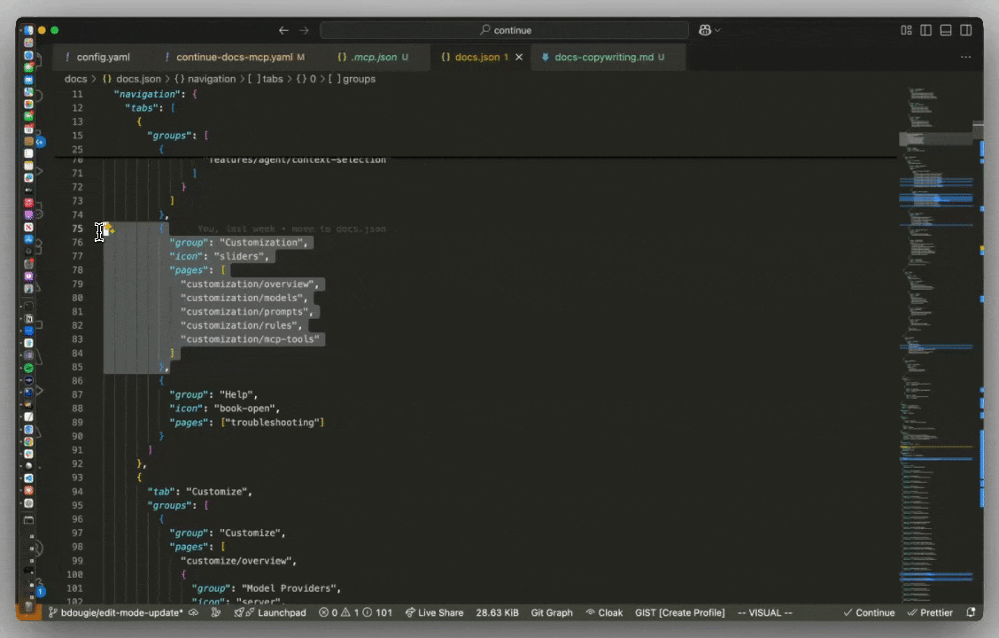

<h1 align="center">Echo DevCon - Alsania AI Code Assistant</h1>

<<<<<<< HEAD
<<<<<<< HEAD
**[Echo DevCon](https://alsania.com/echo-devcon) is Alsania's AI-powered code assistant that enables developers to create, share, and use custom AI assistants with our Echo-branded [VS Code extension](https://marketplace.visualstudio.com/items?itemName=Alsania.echo-devcon-plugin) and comprehensive AI development tools**
=======
**[Echo DevCon](https://alsania.com/devcon) is Alsania's AI-powered code assistant that enables developers to create, share, and use custom AI assistants with our Echo-branded [VS Code extension](https://marketplace.visualstudio.com/items?itemName=Alsania.devcon-plugin) and comprehensive AI development tools**
>>>>>>> 28516c7fabf170e523ba3466dde6fb413f3b0d92
=======
**[Echo DevCon](https://alsania.com/devcon) is Alsania's AI-powered code assistant that enables developers to create, share, and use custom AI assistants with our Echo-branded [VS Code extension](https://marketplace.visualstudio.com/items?itemName=Alsania.devcon-plugin) and comprehensive AI development tools**
>>>>>>> 55d4df0da (big push)

<<<<<<< HEAD
<<<<<<< HEAD
<a target="_blank" href="https://alsania.com/echo-devcon" style="background:none">
    
=======
<a target="_blank" href="https://alsania.com/devcon" style="background:none">
    
>>>>>>> 28516c7fabf170e523ba3466dde6fb413f3b0d92
=======
<a target="_blank" href="https://alsania.com/devcon" style="background:none">
    
>>>>>>> 55d4df0da (big push)
</a>

## Echo Agent

<<<<<<< HEAD
<<<<<<< HEAD
[Echo Agent](https://alsania.com/echo-devcon/docs/agent) enables you to make substantial changes to your codebase with Alsania's AI-powered assistance
=======
[Echo Agent](https://alsania.com/devcon/docs/agent) enables you to make substantial changes to your codebase with Alsania's AI-powered assistance
>>>>>>> 28516c7fabf170e523ba3466dde6fb413f3b0d92
=======
[Echo Agent](https://alsania.com/devcon/docs/agent) enables you to make substantial changes to your codebase with Alsania's AI-powered assistance
>>>>>>> 55d4df0da (big push)

## Echo Chat

<<<<<<< HEAD
<<<<<<< HEAD
[Echo Chat](https://alsania.com/echo-devcon/docs/chat) makes it easy to ask for help from Echo's AI without needing to leave your IDE
=======
[Echo Chat](https://alsania.com/devcon/docs/chat) makes it easy to ask for help from Echo's AI without needing to leave your IDE
>>>>>>> 28516c7fabf170e523ba3466dde6fb413f3b0d92
=======
[Echo Chat](https://alsania.com/devcon/docs/chat) makes it easy to ask for help from Echo's AI without needing to leave your IDE
>>>>>>> 55d4df0da (big push)

## Echo Edit

<<<<<<< HEAD
<<<<<<< HEAD
[Echo Edit](https://alsania.com/echo-devcon/docs/edit) is a convenient way to modify code without leaving your current file using Echo's intelligent suggestions
=======
[Echo Edit](https://alsania.com/devcon/docs/edit) is a convenient way to modify code without leaving your current file using Echo's intelligent suggestions
>>>>>>> 28516c7fabf170e523ba3466dde6fb413f3b0d92
=======
[Echo Edit](https://alsania.com/devcon/docs/edit) is a convenient way to modify code without leaving your current file using Echo's intelligent suggestions
>>>>>>> 55d4df0da (big push)

## Echo Autocomplete

<<<<<<< HEAD
<<<<<<< HEAD
[Echo Autocomplete](https://alsania.com/echo-devcon/docs/autocomplete) provides intelligent inline code suggestions as you type, powered by Alsania's AI
=======
[Echo Autocomplete](https://alsania.com/devcon/docs/autocomplete) provides intelligent inline code suggestions as you type, powered by Alsania's AI
>>>>>>> 28516c7fabf170e523ba3466dde6fb413f3b0d92
=======
[Echo Autocomplete](https://alsania.com/devcon/docs/autocomplete) provides intelligent inline code suggestions as you type, powered by Alsania's AI
>>>>>>> 55d4df0da (big push)

## License

[Apache 2.0 © 2023-2025 Alsania & Echo DevCon Team](./LICENSE)
